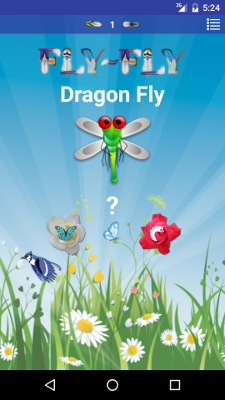

Fly-Fly Android App
===================================

Πετάει-Πετάει ο γάιδαρος? Πετάει!!

Fly-Fly donkey? Fly!!

Doh!!

Was I thinking of the Pegasus from Greek mythology?

Fly-Fly is a game my parents played with me and my sister when we were little.

My parents still tease me about the donkey.

This is my first Android app — it was a good learning experience for me — and I though I’d share it with you.

I hope you have as much fun playing it as we did.

Getting Started
---------------

You can dowload [`Fly-Fly.apk`][1] directly from your Android phone's browser. Once done, open your "Downloads" folder and tap the file to install it.

[1]: https://github.com/sdiaman1/Fly-Fly/blob/master/Fly-Fly.apk?raw=true

By default, android smartphones do not allow installation of third party apps, only those that are sourced from Google Play Store are permissible. Luckily, you can tweak this setting by going to "Menu" > "Settings" > "Security" > check "Unknown Sources".

Start the Fly-Fly app.

You should see a picture of a thing — a dragon fly — and a blue jay flying around a couple of roses; the white rose has a butterfly flying above it, and the red rose has a caterpillar crawling on it.

Tap the white rose with the butterfly if the thing flies, otherwise touch the red rose with the caterpillar if it doesn't.

If you tap the blue jay it will say hello (in bird talk).

If you guessed right, the answer's background is green, otherwise it is red.

The answer is displayed, along with an intersting fact about the dragon fly.

At any time, you can swipe right to go forward to the next thing, or left to go back to the previous thing.

Or you can view a list of all things, by selecting the list icon at the top right of the screen, and select a thing to go to.

